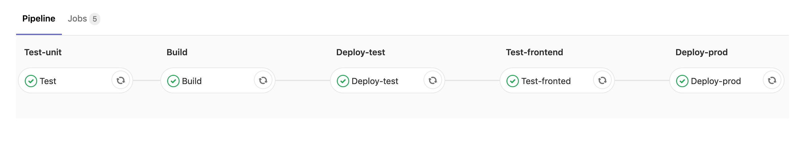

# Refleqt/Gluo - Continuous Deployment Workshop

In this workshop you will use GitLab to setup a CI/CD pipeline that will 
continuously deploy an application, the Crap App.

The pipeline will look like this:

The pipeline consists of the following stages:

1. Running unit tests
2. Building our Docker image
3. Deploying our Docker image to our test environment (Kubernetes)
4. Running UI tests
5. Deploying our Docker images (same as in step 3) to our prod environment 
(Kubernetes)

Everbody will get 2 environments (`test` and `production`), these environments 
are running a large Kubernetes clusters.  These environments will be accessible 
using the following URLs:

* http://envXY-test.cdws.gluo.io
* http://envXY-prod.cdws.gluo.io

Be default both these environments should show the following page:

## Labs

* [Lab 00 - Prerequisites](lab-00)
* [Lab 01 - Repository](lab-01)
* [Lab 02 - Project visibility](lab-02)
* [Lab 03 - Add environment variables to Gitlab](lab-03)
* [Lab 04 - CI/CD pipeline](lab-04)
* [Lab 05 - Container registry](lab-05)
* [Lab 06 - Testing](lab-05)

## People

* Steven Trescinski: steven@gluo.be

## More info

* [Our Website](http://www.gluo.be)