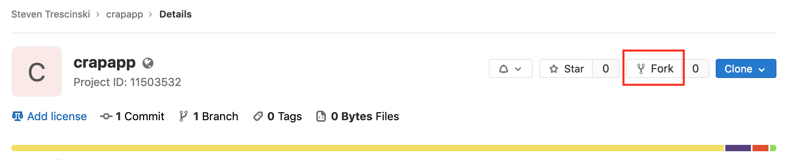

# Lab 01 - Repository

In this first lab you will need to fork the original repository of the Crap App 
into your own GitLab account.

A fork is a copy of a repository. Forking a repository allows you to freely 
experiment with changes without affecting the original project. 

## Task 1: Forking repository

To fork a repository, simply go the URL of the original repository.  For our 
Crap App the URL is:

https://gitlab.com/trescst/crapapp

At the top of the page on the right hand side you should see a `Fork` button.

Click the `Fork` button and, if prompted, select you personal account as a 
target for the fork.

Your for should now be available at the following URL

https://gitlab.com/<YOUR_GITLAB_USERNAME>/crapapp