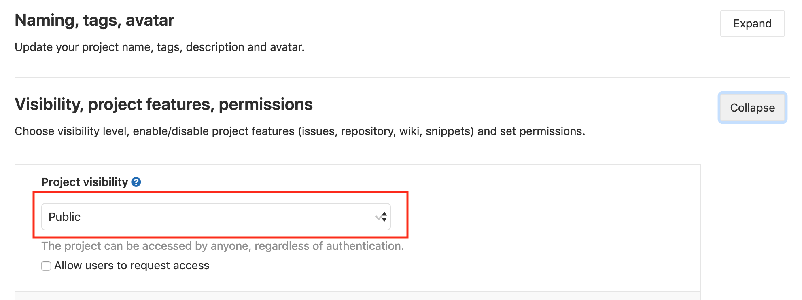

# Lab 02 - Project visibility

In this lab we will change the visibility of our project to `Public`.  Keep in 
mind that from a security point-of-view, it is commonly not best-practice to set 
your project `Public` (unless you developing opensource software of course).

But because this is only a small workshop with no propretary code, setting the 
projects visibility to `Public` will make our live a whole lot easier as we do 
not have to deal will secrets to pull Docker images and/or use SSH keys to 
access our code inside the repository.

## Task 1: Making the repository public

Click on `Settings` on the left side of the project and click `General`. In
this section you can find the second tab `Visibility, project features, permissions`. 

Use the `Expand` tab to check out these settings.

Verify that you `Project visibility` is set to `Public`:

Scroll down a bit and click on `Save changes`. Your repository is now public and
you will be able to access you code with an SSH key and pull your images without 
needing a secret.