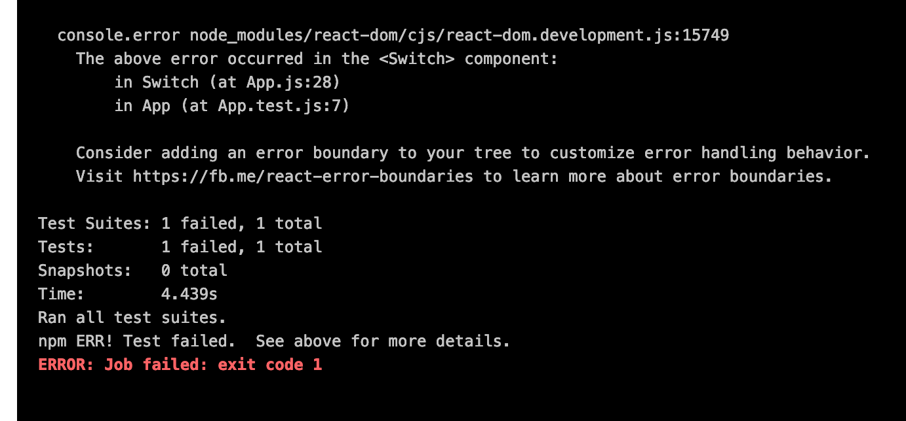
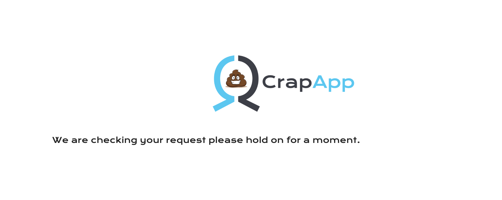
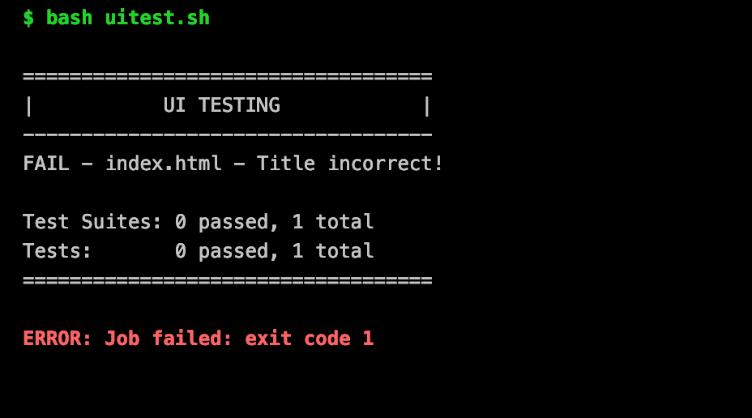

# Lab 06 - Testing

We deliberately injected some bugs in the code so that the automatic tests
fail, the goal of this lab is to fix these bugs so that our pipeline will be 
"green" all the way so that our code can be automatically be deployed to our 
production environment.

## Task 1: Unit test

The unit test should fail with the following error:

The error should give you a pointer to where in the code you should go looking. 
Fix the error using the `Edit` or `WebIDE` and commit your changes.  This should 
automatically trigger a new run of you CI/CD pipeline.

## Task 2: Verify test

Once you have fixed the unit test the Crap App should be deployed to the `test` 
environment, check that this is the case (http://envXY-test.cdws.gluo.io).  You 
should see something like:

## Task 3: UI test

Once the Crap App has been deployed to our `test` environment a simple UI test 
is run, this should also fail:

Again the error should point you in the direction of the piece of code with the 
error.  Fix the code, commit it and watch your CI/CD pipeline be triggered yet 
again.

## Task 4: Verify prod

Once you have fixed the UI test and the pipeline completed its run, the Crap App 
should be deployed to the production environment.  Verify that you indeed see 
the following at the production URL (http:envXY-prod.cdws.gluo.io):

